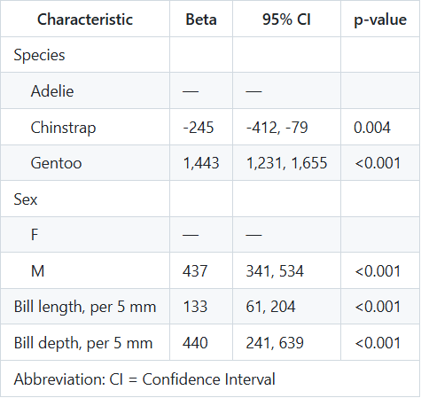

<!-- README.md is generated from README.Rmd. Please edit that file -->

# perinary

<!-- badges: start -->

[](https://github.com/bcjaeger/perinary/actions/workflows/R-CMD-check.yaml)
[](https://app.codecov.io/gh/bcjaeger/perinary)
<!-- badges: end -->

**Why make this?** Data dictionaries (referred to as “dictionaries” from
here) are often developed outside of a computing session and stored as a
static file. Dictionaries are helpful in large projects with many
outputs, providing a central resource for consistent and accurate
annotation of tables and figures. However, the process of making and
using dictionaries is tedious, so `perinary` was developed to reduce
friction.

To make dictionaries, there are two primary classes of functions:

1.  `get`: retrieve meta data from a dictionary
2.  `set`: modify meta data in a dictionary

To use the dictionary, there are three classes of functions:

1.  `translate`: modify names or category labels
2.  `append`: add rows and/or columns to a data frame
3.  `index`: order the rows of a data frame

While `get/set` functions are applied to a dictionary, the `translate`
and `append` functions are members of the `DataDictionary` class,
meaning they are called from the dictionary object.

## Installation

You can install the development version of `perinary` from
[GitHub](https://github.com/) with:

``` r
# install.packages("pak")
pak::pak("perisphere-rwe/perinary")
```

## Data dictionaries

Data dictionaries help organize meta data about variables, storing
information relevant for tables and figures that is not easily stored in
data frames. A data dictionary is most useful in complex projects with
many variables and/or many expected outputs, particularly when
consistency between outputs is a goal.

There are two ways to initialize a dictionary. You can build them using
`NumericVariable` and `NominalVariable` objects (not shown here, see
vignette), but this can be tedious if you have a lot of variables. For
most cases, you’ll want to use the `as_data_dictionary()` to create a
starter dictionary from a given dataset.

``` r

library(perinary)
library(tidyverse)
library(palmerpenguins)

data_peng <- penguins %>% 
  select(species, sex, body_mass_g, bill_length_mm, bill_depth_mm)

dd_peng <- as_data_dictionary(data_peng)

dd_peng
#> Data Dictionary:
#> # A tibble: 5 × 8
#>   name           type    label description units divby_modeling category_levels 
#>   <chr>          <chr>   <chr> <chr>       <chr> <chr>          <chr>           
#> 1 species        Nominal none  none        none  none           Adelie, Chinstr…
#> 2 sex            Nominal none  none        none  none           female and male 
#> 3 body_mass_g    Numeric none  none        none  none           none            
#> 4 bill_length_mm Numeric none  none        none  none           none            
#> 5 bill_depth_mm  Numeric none  none        none  none           none            
#> # ℹ 1 more variable: category_labels <chr>
```

## Retrieve meta data with `get`

Let’s be honest, dictionaries are annoying to write. `perinary` aims to
make it less annoying with `get_unknowns()`. This function tells us what
relevant information is missing from a `dictionary`. If you set
`as_request = TRUE`, a bullet point list is returned in the R console.
This text is intended to help start a discussion about filling in the
gaps.

``` r
get_unknowns(dd_peng, as_request = TRUE)
#> A label to use for this variable in reports:
#> 
#>   - species = ?
#>   - sex = ?
#>   - body_mass_g = ?
#>   - bill_length_mm = ?
#>   - bill_depth_mm = ?
#> 
#> Category labels for this variable (labels are shown in reports):
#> 
#>   - species: Adelie = ?;  Chinstrap = ?;  Gentoo = ?
#>   - sex: female = ?;  male = ?
#> 
#> Variable units (e.g., age in years):
#> 
#>   - body_mass_g = ?
#>   - bill_length_mm = ?
#>   - bill_depth_mm = ?
```

If you want to get straight to filling in unknowns, specify
`as_code = TRUE`:

``` r
get_unknowns(dd_peng, as_code = TRUE)
#> set_labels(species  = "",
#>            sex  = "",
#>            body_mass_g  = "",
#>            bill_length_mm  = "",
#>            bill_depth_mm  = "") %>% 
#> set_category_labels(species = c(Adelie = "",
#>                                 Chinstrap = "",
#>                                 Gentoo = ""),
#>                     sex = c(female = "",
#>                             male = "")) %>% 
#> set_units(body_mass_g  = "",
#>           bill_length_mm  = "",
#>           bill_depth_mm  = "")
```

Other `get` functions include

- `get_term_key()`: returns a `tibble` that links nominal variable
  categories to modeling terms. This is helpful when you want to
  incorporate meta information into standard output from modeling
  functions.

  ``` r
  get_term_key(dd_peng)
  #> # A tibble: 5 × 6
  #>   name    level     label     reference category_type term            
  #>   <chr>   <chr>     <chr>     <lgl>     <chr>         <chr>           
  #> 1 species Adelie    Adelie    TRUE      levels        speciesAdelie   
  #> 2 species Chinstrap Chinstrap FALSE     levels        speciesChinstrap
  #> 3 species Gentoo    Gentoo    FALSE     levels        speciesGentoo   
  #> 4 sex     female    female    TRUE      levels        sexfemale       
  #> 5 sex     male      male      FALSE     levels        sexmale
  ```

- `get_dictionary()`: returns a `tibble` containing raw dictionary meta
  data. This is helpful when you want to apply meta data in a
  non-standard way.

  ``` r
  get_dictionary(dd_peng)
  #> # A tibble: 5 × 7
  #>   name    label description units divby_modeling category_levels category_labels
  #>   <chr>   <chr> <chr>       <chr>          <dbl> <named list>    <named list>   
  #> 1 species <NA>  <NA>        <NA>              NA <chr [3]>       <chr [3]>      
  #> 2 sex     <NA>  <NA>        <NA>              NA <chr [2]>       <chr [2]>      
  #> 3 body_m… <NA>  <NA>        <NA>              NA <NULL>          <NULL>         
  #> 4 bill_l… <NA>  <NA>        <NA>              NA <NULL>          <NULL>         
  #> 5 bill_d… <NA>  <NA>        <NA>              NA <NULL>          <NULL>
  ```

- general `get` functions that are exported from the `DataDictionary`
  class

## Modify dictionaries with `set`

`perinary`’s family of `set` functions provide the interface to modify a
dictionary’s meta data.

``` r

dd_peng <- dd_peng %>% 
  set_labels(species = "Species",
             sex = "Sex",
             body_mass_g = "Body mass",
             bill_length_mm = "Bill length",
             bill_depth_mm = "Bill depth") %>% 
  set_units(bill_length_mm = "mm",
            bill_depth_mm = "mm",
            body_mass_g = "grams") %>% 
  set_divby_modeling(bill_length_mm = 5,
                     bill_depth_mm = 5)
```

### Identifier variables

An identifier variable uniquely defines sampling units in a data set. An
identifier variable can cause disruption in a data dictionary if it is
treated like a factor. For example, we don’t want to supply labels for
each level of an identifier, and we don’t want to summarize data for
each level of an identifier. To demonstrate the problem identifiers can
pose, here’s what would have happened in our call to `get_unknowns()` if
we had an unmanaged identifier variable in the dictionary.

``` r

data_peng %>% 
  mutate(penguid_id = as.character(seq(n()))) %>% 
  as_data_dictionary() %>% 
  get_unknowns(as_request = TRUE)
#> A label to use for this variable in reports:
#> 
#>   - species = ?
#>   - sex = ?
#>   - body_mass_g = ?
#>   - bill_length_mm = ?
#>   - bill_depth_mm = ?
#>   - penguid_id = ?
#> 
#> Category labels for this variable (labels are shown in reports):
#> 
#>   - species: Adelie = ?;  Chinstrap = ?;  Gentoo = ?
#>   - sex: female = ?;  male = ?
#>   - penguid_id: 1 = ?;  2 = ?;  3 = ?;  4 = ?;  5 = ?;  6 = ?;  7 = ?;  8 = ?;  9 = ?;  10 = ?;  11 = ?;  12 = ?;  13 = ?;  14 = ?;  15 = ?;  16 = ?;  17 = ?;  18 = ?;  19 = ?;  20 = ?;  21 = ?;  22 = ?;  23 = ?;  24 = ?;  25 = ?;  26 = ?;  27 = ?;  28 = ?;  29 = ?;  30 = ?;  31 = ?;  32 = ?;  33 = ?;  34 = ?;  35 = ?;  36 = ?;  37 = ?;  38 = ?;  39 = ?;  40 = ?;  41 = ?;  42 = ?;  43 = ?;  44 = ?;  45 = ?;  46 = ?;  47 = ?;  48 = ?;  49 = ?;  50 = ?;  51 = ?;  52 = ?;  53 = ?;  54 = ?;  55 = ?;  56 = ?;  57 = ?;  58 = ?;  59 = ?;  60 = ?;  61 = ?;  62 = ?;  63 = ?;  64 = ?;  65 = ?;  66 = ?;  67 = ?;  68 = ?;  69 = ?;  70 = ?;  71 = ?;  72 = ?;  73 = ?;  74 = ?;  75 = ?;  76 = ?;  77 = ?;  78 = ?;  79 = ?;  80 = ?;  81 = ?;  82 = ?;  83 = ?;  84 = ?;  85 = ?;  86 = ?;  87 = ?;  88 = ?;  89 = ?;  90 = ?;  91 = ?;  92 = ?;  93 = ?;  94 = ?;  95 = ?;  96 = ?;  97 = ?;  98 = ?;  99 = ?;  100 = ?;  101 = ?;  102 = ?;  103 = ?;  104 = ?;  105 = ?;  106 = ?;  107 = ?;  108 = ?;  109 = ?;  110 = ?;  111 = ?;  112 = ?;  113 = ?;  114 = ?;  115 = ?;  116 = ?;  117 = ?;  118 = ?;  119 = ?;  120 = ?;  121 = ?;  122 = ?;  123 = ?;  124 = ?;  125 = ?;  126 = ?;  127 = ?;  128 = ?;  129 = ?;  130 = ?;  131 = ?;  132 = ?;  133 = ?;  134 = ?;  135 = ?;  136 = ?;  137 = ?;  138 = ?;  139 = ?;  140 = ?;  141 = ?;  142 = ?;  143 = ?;  144 = ?;  145 = ?;  146 = ?;  147 = ?;  148 = ?;  149 = ?;  150 = ?;  151 = ?;  152 = ?;  153 = ?;  154 = ?;  155 = ?;  156 = ?;  157 = ?;  158 = ?;  159 = ?;  160 = ?;  161 = ?;  162 = ?;  163 = ?;  164 = ?;  165 = ?;  166 = ?;  167 = ?;  168 = ?;  169 = ?;  170 = ?;  171 = ?;  172 = ?;  173 = ?;  174 = ?;  175 = ?;  176 = ?;  177 = ?;  178 = ?;  179 = ?;  180 = ?;  181 = ?;  182 = ?;  183 = ?;  184 = ?;  185 = ?;  186 = ?;  187 = ?;  188 = ?;  189 = ?;  190 = ?;  191 = ?;  192 = ?;  193 = ?;  194 = ?;  195 = ?;  196 = ?;  197 = ?;  198 = ?;  199 = ?;  200 = ?;  201 = ?;  202 = ?;  203 = ?;  204 = ?;  205 = ?;  206 = ?;  207 = ?;  208 = ?;  209 = ?;  210 = ?;  211 = ?;  212 = ?;  213 = ?;  214 = ?;  215 = ?;  216 = ?;  217 = ?;  218 = ?;  219 = ?;  220 = ?;  221 = ?;  222 = ?;  223 = ?;  224 = ?;  225 = ?;  226 = ?;  227 = ?;  228 = ?;  229 = ?;  230 = ?;  231 = ?;  232 = ?;  233 = ?;  234 = ?;  235 = ?;  236 = ?;  237 = ?;  238 = ?;  239 = ?;  240 = ?;  241 = ?;  242 = ?;  243 = ?;  244 = ?;  245 = ?;  246 = ?;  247 = ?;  248 = ?;  249 = ?;  250 = ?;  251 = ?;  252 = ?;  253 = ?;  254 = ?;  255 = ?;  256 = ?;  257 = ?;  258 = ?;  259 = ?;  260 = ?;  261 = ?;  262 = ?;  263 = ?;  264 = ?;  265 = ?;  266 = ?;  267 = ?;  268 = ?;  269 = ?;  270 = ?;  271 = ?;  272 = ?;  273 = ?;  274 = ?;  275 = ?;  276 = ?;  277 = ?;  278 = ?;  279 = ?;  280 = ?;  281 = ?;  282 = ?;  283 = ?;  284 = ?;  285 = ?;  286 = ?;  287 = ?;  288 = ?;  289 = ?;  290 = ?;  291 = ?;  292 = ?;  293 = ?;  294 = ?;  295 = ?;  296 = ?;  297 = ?;  298 = ?;  299 = ?;  300 = ?;  301 = ?;  302 = ?;  303 = ?;  304 = ?;  305 = ?;  306 = ?;  307 = ?;  308 = ?;  309 = ?;  310 = ?;  311 = ?;  312 = ?;  313 = ?;  314 = ?;  315 = ?;  316 = ?;  317 = ?;  318 = ?;  319 = ?;  320 = ?;  321 = ?;  322 = ?;  323 = ?;  324 = ?;  325 = ?;  326 = ?;  327 = ?;  328 = ?;  329 = ?;  330 = ?;  331 = ?;  332 = ?;  333 = ?;  334 = ?;  335 = ?;  336 = ?;  337 = ?;  338 = ?;  339 = ?;  340 = ?;  341 = ?;  342 = ?;  343 = ?;  344 = ?
#> 
#> Variable units (e.g., age in years):
#> 
#>   - body_mass_g = ?
#>   - bill_length_mm = ?
#>   - bill_depth_mm = ?
```

The issue is that we don’t want or need to supply category labels for
`penguin_id`, so it isn’t helpful for these to be included in our list
of unknowns. The fix is to designate `penguin_id` (or generally any
identifier variables) as an identifier variable, which should take care
of all potential downstream issues.

``` r

data_peng %>% 
  mutate(penguin_id = as.character(seq(n()))) %>% 
  as_data_dictionary() %>% 
  set_identifiers(penguin_id) %>% 
  get_unknowns(as_request = TRUE)
#> A label to use for this variable in reports:
#> 
#>   - species = ?
#>   - sex = ?
#>   - body_mass_g = ?
#>   - bill_length_mm = ?
#>   - bill_depth_mm = ?
#>   - penguin_id = ?
#> 
#> Category labels for this variable (labels are shown in reports):
#> 
#>   - species: Adelie = ?;  Chinstrap = ?;  Gentoo = ?
#>   - sex: female = ?;  male = ?
#> 
#> Variable units (e.g., age in years):
#> 
#>   - body_mass_g = ?
#>   - bill_length_mm = ?
#>   - bill_depth_mm = ?
```

### Nominal variables

Modify the category labels for nominal variables with
`set_category_labels()`:

``` r

dd_peng <- dd_peng %>% 
  set_category_labels(sex = c(female = "Female penguins", 
                              male = "Male penguins"))

dd_peng
#> Data Dictionary:
#> # A tibble: 5 × 8
#>   name           type    label  description units divby_modeling category_levels
#>   <chr>          <chr>   <chr>  <chr>       <chr> <chr>          <chr>          
#> 1 species        Nominal Speci… none        none  none           Adelie, Chinst…
#> 2 sex            Nominal Sex    none        none  none           female and male
#> 3 body_mass_g    Numeric Body … none        grams none           none           
#> 4 bill_length_mm Numeric Bill … none        mm    5              none           
#> 5 bill_depth_mm  Numeric Bill … none        mm    5              none           
#> # ℹ 1 more variable: category_labels <chr>
```

Modify category order for nominal variables with `set_category_order()`:

``` r

# moves the specified category or categories to the front, putting the 
# remaining categories behind with the same relative order to each other

dd_peng <- dd_peng %>% 
  set_category_order(sex = c("male"),
                     species = c("Chinstrap"))

dd_peng
#> Data Dictionary:
#> # A tibble: 5 × 8
#>   name           type    label  description units divby_modeling category_levels
#>   <chr>          <chr>   <chr>  <chr>       <chr> <chr>          <chr>          
#> 1 species        Nominal Speci… none        none  none           Chinstrap, Ade…
#> 2 sex            Nominal Sex    none        none  none           male and female
#> 3 body_mass_g    Numeric Body … none        grams none           none           
#> 4 bill_length_mm Numeric Bill … none        mm    5              none           
#> 5 bill_depth_mm  Numeric Bill … none        mm    5              none           
#> # ℹ 1 more variable: category_labels <chr>
```

## Modify objects using dictionaries

The `translate` function family includes `translate_categories()`,
`translate_names()`, and `translate_data()`. These functions are the
bridge between your `dictionary` and your data. So, how do they work?

- Instead of requiring name-value pairs in the function call,
  `translate` functions look up the relevant name value pairs in
  `dictionary`:

  ``` r
  data_peng %>% 
    mutate(sex = translate_categories(sex, dictionary = dd_peng))
  #> # A tibble: 344 × 5
  #>    species sex             body_mass_g bill_length_mm bill_depth_mm
  #>    <fct>   <chr>                 <int>          <dbl>         <dbl>
  #>  1 Adelie  Male penguins          3750           39.1          18.7
  #>  2 Adelie  Female penguins        3800           39.5          17.4
  #>  3 Adelie  Female penguins        3250           40.3          18  
  #>  4 Adelie  <NA>                     NA           NA            NA  
  #>  5 Adelie  Female penguins        3450           36.7          19.3
  #>  6 Adelie  Male penguins          3650           39.3          20.6
  #>  7 Adelie  Female penguins        3625           38.9          17.8
  #>  8 Adelie  Male penguins          4675           39.2          19.6
  #>  9 Adelie  <NA>                   3475           34.1          18.1
  #> 10 Adelie  <NA>                   4250           42            20.2
  #> # ℹ 334 more rows
  ```

- While `translate_categories()` replaces category levels with labels,
  `translate_names()` replaces variable names with labels. This is
  useful when variable names become column values, e.g., after using
  `pivot_longer` or `melt`:

  ``` r

  data_peng %>% 
    pivot_longer(starts_with("bill_")) %>% 
    mutate(name = translate_names(name, dictionary = dd_peng))
  #> # A tibble: 688 × 5
  #>    species sex    body_mass_g name        value
  #>    <fct>   <fct>        <int> <chr>       <dbl>
  #>  1 Adelie  male          3750 Bill length  39.1
  #>  2 Adelie  male          3750 Bill depth   18.7
  #>  3 Adelie  female        3800 Bill length  39.5
  #>  4 Adelie  female        3800 Bill depth   17.4
  #>  5 Adelie  female        3250 Bill length  40.3
  #>  6 Adelie  female        3250 Bill depth   18  
  #>  7 Adelie  <NA>            NA Bill length  NA  
  #>  8 Adelie  <NA>            NA Bill depth   NA  
  #>  9 Adelie  female        3450 Bill length  36.7
  #> 10 Adelie  female        3450 Bill depth   19.3
  #> # ℹ 678 more rows
  ```

- `translate_data()` is a general convenience tool that:

  - sets variable labels as column attributes

  - recodes category levels to corresponding labels

  - converts characters to factors (factors are required to apply the
    category order specified in the dictionary)

  - divide continuous variables by their corresponding modeling divisor
    if \`units = ‘model’, and update labels accordingly

  ``` r
  data_peng %>% 
    translate_data(dictionary = dd_peng)
  #> # A tibble: 344 × 5
  #>    species sex             body_mass_g bill_length_mm bill_depth_mm
  #>    <fct>   <fct>                 <int>          <dbl>         <dbl>
  #>  1 Adelie  Male penguins          3750           39.1          18.7
  #>  2 Adelie  Female penguins        3800           39.5          17.4
  #>  3 Adelie  Female penguins        3250           40.3          18  
  #>  4 Adelie  <NA>                     NA           NA            NA  
  #>  5 Adelie  Female penguins        3450           36.7          19.3
  #>  6 Adelie  Male penguins          3650           39.3          20.6
  #>  7 Adelie  Female penguins        3625           38.9          17.8
  #>  8 Adelie  Male penguins          4675           39.2          19.6
  #>  9 Adelie  <NA>                   3475           34.1          18.1
  #> 10 Adelie  <NA>                   4250           42            20.2
  #> # ℹ 334 more rows
  ```

## Set your default

Writing meta data in a `dictionary` *should* make it easier to put that
information in outputs. However, supplying the `dictionary` as an input
to every single `perinary` function gets unnecessarily tedious. For
convenience, you can save any `dictionary` you make as the “default”
dictionary for `perinary` functions during your current R session. The
default dictionary will be used whenever a `perinary` function is called
and a `dictionary` is not explicitly supplied by the user.

``` r

set_default_dictionary(dd_peng)

data_peng %>% 
  pivot_longer(starts_with("bill_")) %>% 
  mutate(name = translate_names(name),
         sex = translate_categories(sex))
#> # A tibble: 688 × 5
#>    species sex             body_mass_g name        value
#>    <fct>   <chr>                 <int> <chr>       <dbl>
#>  1 Adelie  Male penguins          3750 Bill length  39.1
#>  2 Adelie  Male penguins          3750 Bill depth   18.7
#>  3 Adelie  Female penguins        3800 Bill length  39.5
#>  4 Adelie  Female penguins        3800 Bill depth   17.4
#>  5 Adelie  Female penguins        3250 Bill length  40.3
#>  6 Adelie  Female penguins        3250 Bill depth   18  
#>  7 Adelie  <NA>                     NA Bill length  NA  
#>  8 Adelie  <NA>                     NA Bill depth   NA  
#>  9 Adelie  Female penguins        3450 Bill length  36.7
#> 10 Adelie  Female penguins        3450 Bill depth   19.3
#> # ℹ 678 more rows
```

**Note:** for the remainder of the `ReadMe`, we *could* omit
`dictionary = dd_peng` in all `perinary` functions because we have set
that as our default. However, we do not take this semantic shortcut
because it may be confusing for readers who skip sections or who
copy/paste example code.

## Model output and dictionaries

If you are using a package like `gtsummary`, which incorporates variable
labels automatically, `translate()` is probably all you need from
`perinary`. In the example below, we translate our data with `units` set
to `"model"`, which additionally preps continuous variables by dividing
them by their modeling unit and (e.g., bill length is modeled per 10 mm)
and updates labels accordingly.

``` r

library(gtsummary)

data_peng %>% 
  translate_data(units = 'model', dictionary = dd_peng) %>% 
  lm(formula = body_mass_g ~ sex + species + bill_length_mm + bill_depth_mm, 
     data = .) %>% 
  tbl_regression()
```

``` r

```


In rare cases, `gtsummary` may not provide tools to tabulate our
regression results. In those cases, we can use functions from the
`append` and `index` class.

Let’s start with tidied model output from `broom`:

``` r

library(broom)

fit <- data_peng %>% 
  translate_data(units = 'model', dictionary = dd_peng) %>% 
  lm(formula = body_mass_g ~ sex + species + bill_length_mm + bill_depth_mm, 
     data = .) %>% 
  tidy(conf.int = TRUE)

fit
#> # A tibble: 6 × 7
#>   term               estimate std.error statistic  p.value conf.low conf.high
#>   <chr>                 <dbl>     <dbl>     <dbl>    <dbl>    <dbl>     <dbl>
#> 1 (Intercept)           1036.     482.       2.15 3.24e- 2     87.6     1984.
#> 2 sexFemale penguins    -437.      49.1     -8.90 3.84e-17   -534.      -341.
#> 3 speciesAdelie          245.      84.6      2.90 4.01e- 3     78.7      412.
#> 4 speciesGentoo         1689.      82.2     20.5  8.99e-61   1527.      1850.
#> 5 bill_length_mm         133.      36.2      3.66 2.90e- 4     61.4      204.
#> 6 bill_depth_mm          440.     101.       4.35 1.83e- 5    241.       639.
```

We use `append_term_key()` to add columns indicating variable name,
category level, category label, and reference groups to the model output
(a row is also added for each reference group).

``` r

fit_appended <- append_term_key(fit, dictionary = dd_peng)

fit_appended
#> # A tibble: 8 × 11
#>   name        level label reference term  estimate std.error statistic   p.value
#>   <chr>       <chr> <chr> <lgl>     <chr>    <dbl>     <dbl>     <dbl>     <dbl>
#> 1 (Intercept) <NA>  <NA>  FALSE     (Int…    1036.     482.       2.15  3.24e- 2
#> 2 sex         male  Male… TRUE      sexM…      NA       NA       NA    NA       
#> 3 sex         fema… Fema… FALSE     sexF…    -437.      49.1     -8.90  3.84e-17
#> 4 species     Chin… Chin… TRUE      spec…      NA       NA       NA    NA       
#> 5 species     Adel… Adel… FALSE     spec…     245.      84.6      2.90  4.01e- 3
#> 6 species     Gent… Gent… FALSE     spec…    1689.      82.2     20.5   8.99e-61
#> 7 bill_lengt… <NA>  <NA>  FALSE     bill…     133.      36.2      3.66  2.90e- 4
#> 8 bill_depth… <NA>  <NA>  FALSE     bill…     440.     101.       4.35  1.83e- 5
#> # ℹ 2 more variables: conf.low <dbl>, conf.high <dbl>
```

Second, we use `index_terms` to re-order the rows of these data based on
the order they appear in the dictionary. This is helpful when you want
variables to be listed in consistent order throughout your report.

``` r

fit_sorted <- index_terms(fit_appended, dictionary = dd_peng)
```

Third, we tabulate the results

``` r

library(gt)
library(table.glue)

data_gt <- fit_sorted %>% 
  filter(name != "(Intercept)") %>% 
  # push labels for continuous bill variables into the label column
  mutate(
    label = coalesce(label, 
                     translate_names(name, units = 'model', 
                                     dictionary = dd_peng)
    )
  ) %>% 
  # Add a custom group for the bill variables
  add_count(name) %>% 
  mutate(name = if_else(n==1, 
                        "Bill dimensions", 
                        translate_names(name))) %>% 
  # drop unused columns and make final modifications
  transmute(
    name, 
    label,
    # format results with table.glue
    estimate = if_else(
      reference, 
      true = "0 (reference)", 
      false = table_glue("{estimate} ({conf.low}, {conf.high})")),
    p.value = table_pvalue(p.value)
  )

gt(data_gt, groupname_col = 'name', rowname_col = 'label') %>% 
  tab_style(
    style = cell_text(indent = px(16)),           
    locations = cells_stub()
  ) %>% 
  cols_align('center', columns = c(estimate, p.value)) %>% 
  cols_label(estimate = md("Estimated body mass<br/>difference, grams (95% CI)"), 
             p.value = "P-value") %>% 
  tab_stubhead(label = md("**Characteristic**")) %>% 
  tab_options(table.width = pct(80))
```

<div id="pxjoqicejv" style="padding-left:0px;padding-right:0px;padding-top:10px;padding-bottom:10px;overflow-x:auto;overflow-y:auto;width:auto;height:auto;">
<style>#pxjoqicejv table {
  font-family: system-ui, 'Segoe UI', Roboto, Helvetica, Arial, sans-serif, 'Apple Color Emoji', 'Segoe UI Emoji', 'Segoe UI Symbol', 'Noto Color Emoji';
  -webkit-font-smoothing: antialiased;
  -moz-osx-font-smoothing: grayscale;
}
&#10;#pxjoqicejv thead, #pxjoqicejv tbody, #pxjoqicejv tfoot, #pxjoqicejv tr, #pxjoqicejv td, #pxjoqicejv th {
  border-style: none;
}
&#10;#pxjoqicejv p {
  margin: 0;
  padding: 0;
}
&#10;#pxjoqicejv .gt_table {
  display: table;
  border-collapse: collapse;
  line-height: normal;
  margin-left: auto;
  margin-right: auto;
  color: #333333;
  font-size: 16px;
  font-weight: normal;
  font-style: normal;
  background-color: #FFFFFF;
  width: 80%;
  border-top-style: solid;
  border-top-width: 2px;
  border-top-color: #A8A8A8;
  border-right-style: none;
  border-right-width: 2px;
  border-right-color: #D3D3D3;
  border-bottom-style: solid;
  border-bottom-width: 2px;
  border-bottom-color: #A8A8A8;
  border-left-style: none;
  border-left-width: 2px;
  border-left-color: #D3D3D3;
}
&#10;#pxjoqicejv .gt_caption {
  padding-top: 4px;
  padding-bottom: 4px;
}
&#10;#pxjoqicejv .gt_title {
  color: #333333;
  font-size: 125%;
  font-weight: initial;
  padding-top: 4px;
  padding-bottom: 4px;
  padding-left: 5px;
  padding-right: 5px;
  border-bottom-color: #FFFFFF;
  border-bottom-width: 0;
}
&#10;#pxjoqicejv .gt_subtitle {
  color: #333333;
  font-size: 85%;
  font-weight: initial;
  padding-top: 3px;
  padding-bottom: 5px;
  padding-left: 5px;
  padding-right: 5px;
  border-top-color: #FFFFFF;
  border-top-width: 0;
}
&#10;#pxjoqicejv .gt_heading {
  background-color: #FFFFFF;
  text-align: center;
  border-bottom-color: #FFFFFF;
  border-left-style: none;
  border-left-width: 1px;
  border-left-color: #D3D3D3;
  border-right-style: none;
  border-right-width: 1px;
  border-right-color: #D3D3D3;
}
&#10;#pxjoqicejv .gt_bottom_border {
  border-bottom-style: solid;
  border-bottom-width: 2px;
  border-bottom-color: #D3D3D3;
}
&#10;#pxjoqicejv .gt_col_headings {
  border-top-style: solid;
  border-top-width: 2px;
  border-top-color: #D3D3D3;
  border-bottom-style: solid;
  border-bottom-width: 2px;
  border-bottom-color: #D3D3D3;
  border-left-style: none;
  border-left-width: 1px;
  border-left-color: #D3D3D3;
  border-right-style: none;
  border-right-width: 1px;
  border-right-color: #D3D3D3;
}
&#10;#pxjoqicejv .gt_col_heading {
  color: #333333;
  background-color: #FFFFFF;
  font-size: 100%;
  font-weight: normal;
  text-transform: inherit;
  border-left-style: none;
  border-left-width: 1px;
  border-left-color: #D3D3D3;
  border-right-style: none;
  border-right-width: 1px;
  border-right-color: #D3D3D3;
  vertical-align: bottom;
  padding-top: 5px;
  padding-bottom: 6px;
  padding-left: 5px;
  padding-right: 5px;
  overflow-x: hidden;
}
&#10;#pxjoqicejv .gt_column_spanner_outer {
  color: #333333;
  background-color: #FFFFFF;
  font-size: 100%;
  font-weight: normal;
  text-transform: inherit;
  padding-top: 0;
  padding-bottom: 0;
  padding-left: 4px;
  padding-right: 4px;
}
&#10;#pxjoqicejv .gt_column_spanner_outer:first-child {
  padding-left: 0;
}
&#10;#pxjoqicejv .gt_column_spanner_outer:last-child {
  padding-right: 0;
}
&#10;#pxjoqicejv .gt_column_spanner {
  border-bottom-style: solid;
  border-bottom-width: 2px;
  border-bottom-color: #D3D3D3;
  vertical-align: bottom;
  padding-top: 5px;
  padding-bottom: 5px;
  overflow-x: hidden;
  display: inline-block;
  width: 100%;
}
&#10;#pxjoqicejv .gt_spanner_row {
  border-bottom-style: hidden;
}
&#10;#pxjoqicejv .gt_group_heading {
  padding-top: 8px;
  padding-bottom: 8px;
  padding-left: 5px;
  padding-right: 5px;
  color: #333333;
  background-color: #FFFFFF;
  font-size: 100%;
  font-weight: initial;
  text-transform: inherit;
  border-top-style: solid;
  border-top-width: 2px;
  border-top-color: #D3D3D3;
  border-bottom-style: solid;
  border-bottom-width: 2px;
  border-bottom-color: #D3D3D3;
  border-left-style: none;
  border-left-width: 1px;
  border-left-color: #D3D3D3;
  border-right-style: none;
  border-right-width: 1px;
  border-right-color: #D3D3D3;
  vertical-align: middle;
  text-align: left;
}
&#10;#pxjoqicejv .gt_empty_group_heading {
  padding: 0.5px;
  color: #333333;
  background-color: #FFFFFF;
  font-size: 100%;
  font-weight: initial;
  border-top-style: solid;
  border-top-width: 2px;
  border-top-color: #D3D3D3;
  border-bottom-style: solid;
  border-bottom-width: 2px;
  border-bottom-color: #D3D3D3;
  vertical-align: middle;
}
&#10;#pxjoqicejv .gt_from_md > :first-child {
  margin-top: 0;
}
&#10;#pxjoqicejv .gt_from_md > :last-child {
  margin-bottom: 0;
}
&#10;#pxjoqicejv .gt_row {
  padding-top: 8px;
  padding-bottom: 8px;
  padding-left: 5px;
  padding-right: 5px;
  margin: 10px;
  border-top-style: solid;
  border-top-width: 1px;
  border-top-color: #D3D3D3;
  border-left-style: none;
  border-left-width: 1px;
  border-left-color: #D3D3D3;
  border-right-style: none;
  border-right-width: 1px;
  border-right-color: #D3D3D3;
  vertical-align: middle;
  overflow-x: hidden;
}
&#10;#pxjoqicejv .gt_stub {
  color: #333333;
  background-color: #FFFFFF;
  font-size: 100%;
  font-weight: initial;
  text-transform: inherit;
  border-right-style: solid;
  border-right-width: 2px;
  border-right-color: #D3D3D3;
  padding-left: 5px;
  padding-right: 5px;
}
&#10;#pxjoqicejv .gt_stub_row_group {
  color: #333333;
  background-color: #FFFFFF;
  font-size: 100%;
  font-weight: initial;
  text-transform: inherit;
  border-right-style: solid;
  border-right-width: 2px;
  border-right-color: #D3D3D3;
  padding-left: 5px;
  padding-right: 5px;
  vertical-align: top;
}
&#10;#pxjoqicejv .gt_row_group_first td {
  border-top-width: 2px;
}
&#10;#pxjoqicejv .gt_row_group_first th {
  border-top-width: 2px;
}
&#10;#pxjoqicejv .gt_summary_row {
  color: #333333;
  background-color: #FFFFFF;
  text-transform: inherit;
  padding-top: 8px;
  padding-bottom: 8px;
  padding-left: 5px;
  padding-right: 5px;
}
&#10;#pxjoqicejv .gt_first_summary_row {
  border-top-style: solid;
  border-top-color: #D3D3D3;
}
&#10;#pxjoqicejv .gt_first_summary_row.thick {
  border-top-width: 2px;
}
&#10;#pxjoqicejv .gt_last_summary_row {
  padding-top: 8px;
  padding-bottom: 8px;
  padding-left: 5px;
  padding-right: 5px;
  border-bottom-style: solid;
  border-bottom-width: 2px;
  border-bottom-color: #D3D3D3;
}
&#10;#pxjoqicejv .gt_grand_summary_row {
  color: #333333;
  background-color: #FFFFFF;
  text-transform: inherit;
  padding-top: 8px;
  padding-bottom: 8px;
  padding-left: 5px;
  padding-right: 5px;
}
&#10;#pxjoqicejv .gt_first_grand_summary_row {
  padding-top: 8px;
  padding-bottom: 8px;
  padding-left: 5px;
  padding-right: 5px;
  border-top-style: double;
  border-top-width: 6px;
  border-top-color: #D3D3D3;
}
&#10;#pxjoqicejv .gt_last_grand_summary_row_top {
  padding-top: 8px;
  padding-bottom: 8px;
  padding-left: 5px;
  padding-right: 5px;
  border-bottom-style: double;
  border-bottom-width: 6px;
  border-bottom-color: #D3D3D3;
}
&#10;#pxjoqicejv .gt_striped {
  background-color: rgba(128, 128, 128, 0.05);
}
&#10;#pxjoqicejv .gt_table_body {
  border-top-style: solid;
  border-top-width: 2px;
  border-top-color: #D3D3D3;
  border-bottom-style: solid;
  border-bottom-width: 2px;
  border-bottom-color: #D3D3D3;
}
&#10;#pxjoqicejv .gt_footnotes {
  color: #333333;
  background-color: #FFFFFF;
  border-bottom-style: none;
  border-bottom-width: 2px;
  border-bottom-color: #D3D3D3;
  border-left-style: none;
  border-left-width: 2px;
  border-left-color: #D3D3D3;
  border-right-style: none;
  border-right-width: 2px;
  border-right-color: #D3D3D3;
}
&#10;#pxjoqicejv .gt_footnote {
  margin: 0px;
  font-size: 90%;
  padding-top: 4px;
  padding-bottom: 4px;
  padding-left: 5px;
  padding-right: 5px;
}
&#10;#pxjoqicejv .gt_sourcenotes {
  color: #333333;
  background-color: #FFFFFF;
  border-bottom-style: none;
  border-bottom-width: 2px;
  border-bottom-color: #D3D3D3;
  border-left-style: none;
  border-left-width: 2px;
  border-left-color: #D3D3D3;
  border-right-style: none;
  border-right-width: 2px;
  border-right-color: #D3D3D3;
}
&#10;#pxjoqicejv .gt_sourcenote {
  font-size: 90%;
  padding-top: 4px;
  padding-bottom: 4px;
  padding-left: 5px;
  padding-right: 5px;
}
&#10;#pxjoqicejv .gt_left {
  text-align: left;
}
&#10;#pxjoqicejv .gt_center {
  text-align: center;
}
&#10;#pxjoqicejv .gt_right {
  text-align: right;
  font-variant-numeric: tabular-nums;
}
&#10;#pxjoqicejv .gt_font_normal {
  font-weight: normal;
}
&#10;#pxjoqicejv .gt_font_bold {
  font-weight: bold;
}
&#10;#pxjoqicejv .gt_font_italic {
  font-style: italic;
}
&#10;#pxjoqicejv .gt_super {
  font-size: 65%;
}
&#10;#pxjoqicejv .gt_footnote_marks {
  font-size: 75%;
  vertical-align: 0.4em;
  position: initial;
}
&#10;#pxjoqicejv .gt_asterisk {
  font-size: 100%;
  vertical-align: 0;
}
&#10;#pxjoqicejv .gt_indent_1 {
  text-indent: 5px;
}
&#10;#pxjoqicejv .gt_indent_2 {
  text-indent: 10px;
}
&#10;#pxjoqicejv .gt_indent_3 {
  text-indent: 15px;
}
&#10;#pxjoqicejv .gt_indent_4 {
  text-indent: 20px;
}
&#10;#pxjoqicejv .gt_indent_5 {
  text-indent: 25px;
}
&#10;#pxjoqicejv .katex-display {
  display: inline-flex !important;
  margin-bottom: 0.75em !important;
}
&#10;#pxjoqicejv div.Reactable > div.rt-table > div.rt-thead > div.rt-tr.rt-tr-group-header > div.rt-th-group:after {
  height: 0px !important;
}
</style>
<table class="gt_table" data-quarto-disable-processing="false" data-quarto-bootstrap="false">
  <thead>
    <tr class="gt_col_headings">
      <th class="gt_col_heading gt_columns_bottom_border gt_left" rowspan="1" colspan="1" scope="col" id="a::stub"><span class='gt_from_md'><strong>Characteristic</strong></span></th>
      <th class="gt_col_heading gt_columns_bottom_border gt_center" rowspan="1" colspan="1" scope="col" id="estimate"><span class='gt_from_md'>Estimated body mass<br/>difference, grams (95% CI)</span></th>
      <th class="gt_col_heading gt_columns_bottom_border gt_center" rowspan="1" colspan="1" scope="col" id="p.value">P-value</th>
    </tr>
  </thead>
  <tbody class="gt_table_body">
    <tr class="gt_group_heading_row">
      <th colspan="3" class="gt_group_heading" scope="colgroup" id="Species">Species</th>
    </tr>
    <tr class="gt_row_group_first"><th id="stub_1_1" scope="row" class="gt_row gt_left gt_stub" style="text-indent: 16px;">Chinstrap</th>
<td headers="Species stub_1_1 estimate" class="gt_row gt_center">0 (reference)</td>
<td headers="Species stub_1_1 p.value" class="gt_row gt_center">--</td></tr>
    <tr><th id="stub_1_2" scope="row" class="gt_row gt_left gt_stub" style="text-indent: 16px;">Adelie</th>
<td headers="Species stub_1_2 estimate" class="gt_row gt_center">245 (79, 412)</td>
<td headers="Species stub_1_2 p.value" class="gt_row gt_center">.004</td></tr>
    <tr><th id="stub_1_3" scope="row" class="gt_row gt_left gt_stub" style="text-indent: 16px;">Gentoo</th>
<td headers="Species stub_1_3 estimate" class="gt_row gt_center">1,689 (1,527, 1,850)</td>
<td headers="Species stub_1_3 p.value" class="gt_row gt_center">&lt;.001</td></tr>
    <tr class="gt_group_heading_row">
      <th colspan="3" class="gt_group_heading" scope="colgroup" id="Sex">Sex</th>
    </tr>
    <tr class="gt_row_group_first"><th id="stub_1_4" scope="row" class="gt_row gt_left gt_stub" style="text-indent: 16px;">Male penguins</th>
<td headers="Sex stub_1_4 estimate" class="gt_row gt_center">0 (reference)</td>
<td headers="Sex stub_1_4 p.value" class="gt_row gt_center">--</td></tr>
    <tr><th id="stub_1_5" scope="row" class="gt_row gt_left gt_stub" style="text-indent: 16px;">Female penguins</th>
<td headers="Sex stub_1_5 estimate" class="gt_row gt_center">-437 (-534, -341)</td>
<td headers="Sex stub_1_5 p.value" class="gt_row gt_center">&lt;.001</td></tr>
    <tr class="gt_group_heading_row">
      <th colspan="3" class="gt_group_heading" scope="colgroup" id="Bill dimensions">Bill dimensions</th>
    </tr>
    <tr class="gt_row_group_first"><th id="stub_1_6" scope="row" class="gt_row gt_left gt_stub" style="text-indent: 16px;">Bill length, per 5 mm</th>
<td headers="Bill dimensions stub_1_6 estimate" class="gt_row gt_center">133 (61, 204)</td>
<td headers="Bill dimensions stub_1_6 p.value" class="gt_row gt_center">&lt;.001</td></tr>
    <tr><th id="stub_1_7" scope="row" class="gt_row gt_left gt_stub" style="text-indent: 16px;">Bill depth, per 5 mm</th>
<td headers="Bill dimensions stub_1_7 estimate" class="gt_row gt_center">440 (241, 639)</td>
<td headers="Bill dimensions stub_1_7 p.value" class="gt_row gt_center">&lt;.001</td></tr>
  </tbody>
  &#10;  
</table>
</div>
